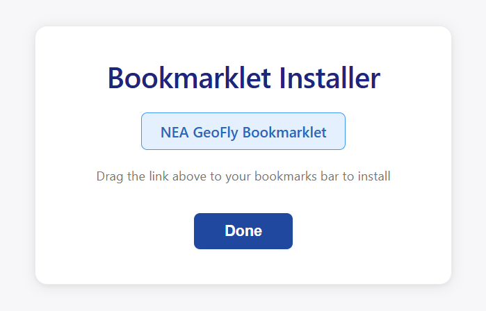
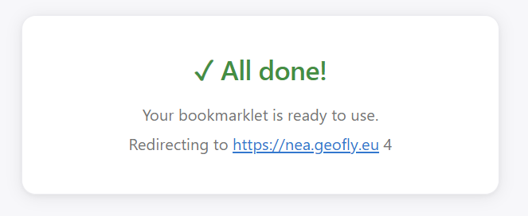
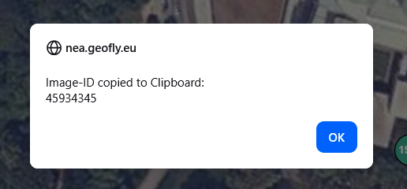

# Usage

## Preparation 

For identifying the Image IDs you want to download, you can use the bookmarklet to easily extract the ID from the image page on https://nea.geofly.eu.

1. Run the application with argument  `--bookmarklet` once to install a bookmarklet to your browser's bookmarks bar.


2. Hit `Done` Button to finishe the setup


3. When you click the bookmarklet, it will extract the selected image ID and copy it to your clipboard.




## Run application

You can call application directly with some arguments to skip interactive prompting:

```text
$ poetry run python src/main.py -h
usage: main.py [-h] [-i ID [ID ...]] [-z ZOOM] [-o OUTPUT_DIR] [-n FILENAME_PATTERN] [--no-download] [--no-kml] [--no-txt] [-b] [-v]

Downloads an Image by ID from https://nea.geofly.eu.
If not arguments are set, values will be prompted for interactively.

options:
  -h, --help            show this help message and exit
  -i, --id ID [ID ...]  Image ID(s).
  -z, --zoom ZOOM       Zoom level. You can specify 'max' or 'min' to use the highest/lowest zoom level for any image.
  -o, --output-dir OUTPUT_DIR
                        Destination directory for downloaded files.
  -n, --filename-pattern FILENAME_PATTERN
                        Custom file-name pattern using str.format placeholders like {name}, {date}, {location}, {id}, {width}, {height}, {origin}, {spectral} and {zoom}.
  --no-download         Skip downloading and saving the stitched image file.
  --no-kml              Skip generating and saving the KML file.
  --no-txt              Skip generating and saving the metadata text file.

Setup:
  -b, --bookmarklet     Setup Bookmarklet

Version:
  -v, --version         Show the application version and exit.

Version: 0.0.0
```

Use `--output-dir` to store the generated `.jpg`, `.txt`, and `.kml` files in a specific directory:

```bash
poetry run python src/main.py --id 123456 --zoom max --output-dir downloads
```

Use `--no-download` to fetch image metadata and create the `.txt` and `.kml`
files without downloading or storing the stitched image:

```bash
poetry run python src/main.py --id 123456 --zoom max --no-download
```

Use `--no-kml` to skip writing the `.kml` file while still saving the other outputs:

```bash
poetry run python src/main.py --id 123456 --zoom max --no-kml
```

Use `--no-txt` to skip writing the metadata `.txt` file while still saving the other outputs:

```bash
poetry run python src/main.py --id 123456 --zoom max --no-txt
```

Use `--filename-pattern` to customize the shared base name of the generated files.
The pattern uses Python `str.format(...)` placeholders.

Available placeholders include:

- `id`
- `name`
- `date`
- `location`
- `width`
- `height`
- `origin`
- `spectral`
- `zoom`

**Example**:

```bash
poetry run python src/main.py --id 123456 --zoom max --filename-pattern "{date}_{id}_{zoom}"
```
